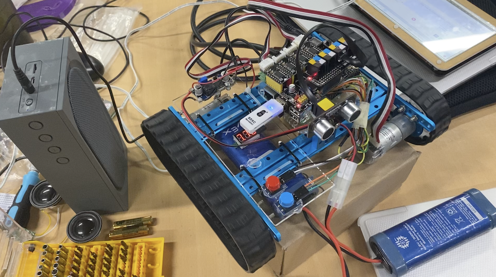

# library-robot
An automated robot to ensure a quiet study atmosphere, and inform students when it is time to go home.

The original project is described at [https://github.com/lolmrdabbydab/MakeBlock-UltraSonicSensor](https://github.com/lolmrdabbydab/MakeBlock-UltraSonicSensor)

This _passion project_ by the students My Nguyen, Thai Le, Phu Le and Triet Do.

A video about this project can be [found on YouTube](https://youtu.be/Inp2bbtwn5M)

Developed by Milly, Phy and Thai, this robot listens to the noise in the library and shouts a warning if it is too loud. At the end of the day, the librarian can just press a button, and the robot will drive around the library automatically, avoid obstacles with the ultrasonic distance sensor and repead every 10 seconds the message to clear the library.

On Friday, May 6th the robot reached a final stage. It was driving correctly, had three different mp3 outputs, reacted to the ultrasonic sensor and no longer required a screen:



It is build as MakeBot with a MegaPi driver board. The instructions are sent by the Raspberry Pi below. This one also senses the distance with ultrasonic and plays the sound. The program is written in python:

``` py
from megapi import *
import time
import pygame
import RPi.GPIO as GPIO

announce = time.time()
distance = 123

# -=Function=-
def Forward(port, speed):
	sleep(0.4)
	bot.encoderMotorRun(port,speed)

def Backward(port, speed):
	bot.encoderMotorRun(port, speed)

# -=UltrasonicSensor=-
def UltraSonic(port):
	global distance
	distance = port
	print(distance)

# -=SoundPlay=-
def SoundPlay(SoundFile):
	SoundList = ["Ms C.mp3", "Mr Williams.mp3"] # Ms. C = 0 | Mr. W = 1
	pygame.mixer.init()
	pygame.mixer.music.set_volume(0.2) # Volume: (0 - 1)
	pygame.mixer.music.load(SoundList[SoundFile])
	pygame.mixer.music.play()
	while pygame.mixer.music.get_busy() == True:
		continue

# -=GPIO=-
GPIO.setwarnings(False)
GPIO.setmode(GPIO.BOARD)

	# Speaker
speaker_buttonPin1 = 32
speaker_buttonPin2 = 22
GPIO.setup(speaker_buttonPin1, GPIO.IN, pull_up_down=GPIO.PUD_DOWN)
GPIO.setup(speaker_buttonPin2, GPIO.IN, pull_up_down=GPIO.PUD_DOWN)

    # Sound Sensor
sound_sensorPin = 18
GPIO.setup(sound_sensorPin, GPIO.IN, pull_up_down=GPIO.PUD_DOWN)

# -=Main=-
if __name__ == '__main__':
	bot = MegaPi()
	bot.start()
	output = 0

	while True:
		# -=SET UP=-
		if GPIO.input(speaker_buttonPin1) == GPIO.HIGH:
			output = 1
		
		elif GPIO.input(speaker_buttonPin2) == GPIO.HIGH:
			output = 2
		
		else:
			pass

		# -=GO OUT=-
		if output == 1:
			
			# Sound
			print(f"Time: {announce}")
			if time.time() - announce > 10:
				announce = time.time()
				SoundPlay(0)
#			SoundPlay(0)
				
			# Ultra Sonic
			bot.ultrasonicSensorRead(6,UltraSonic)
			
			# Movement
			if distance < 8:
				print(f"Smaller distance: {distance}")
				Forward(4,-50)
				Backward(1, 0)
			else:
				Forward(4, -50) # Left Wheel -25
                Backward(4,-50)
				Backward(1, 50) # Right Wheel 25

		# -=BE QUIET=-
		elif output == 2:
			if GPIO.input(sound_sensorPin) == GPIO.HIGH:
				SoundPlay(1)
		
		else:
			pass
	

```

To be continued.
